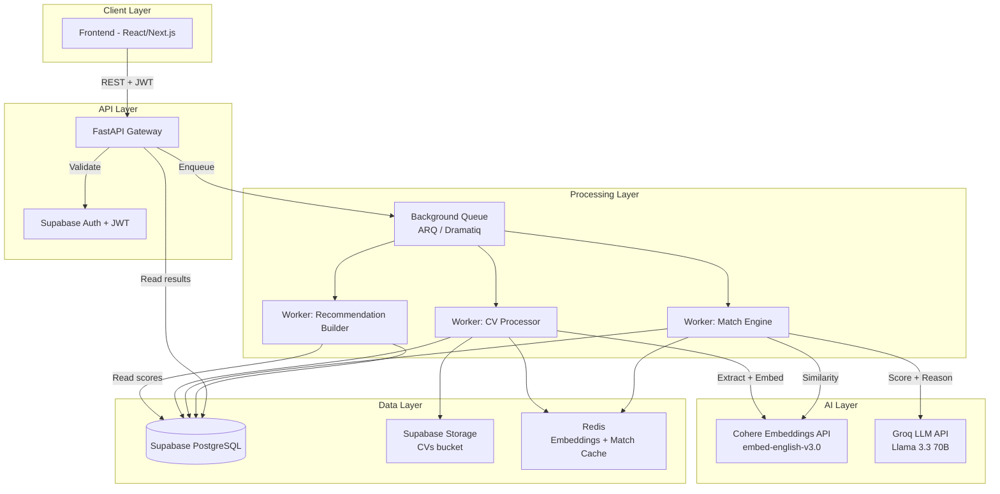
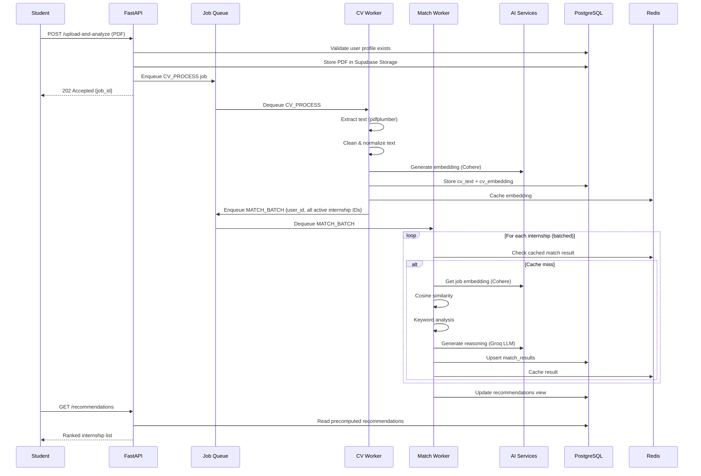
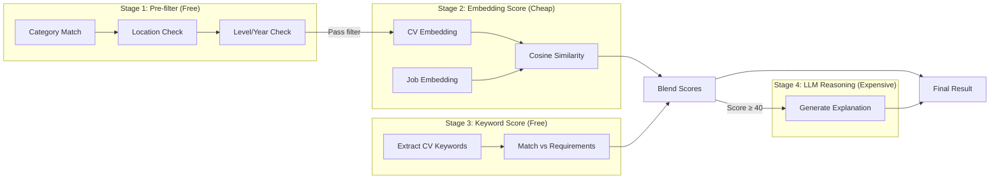
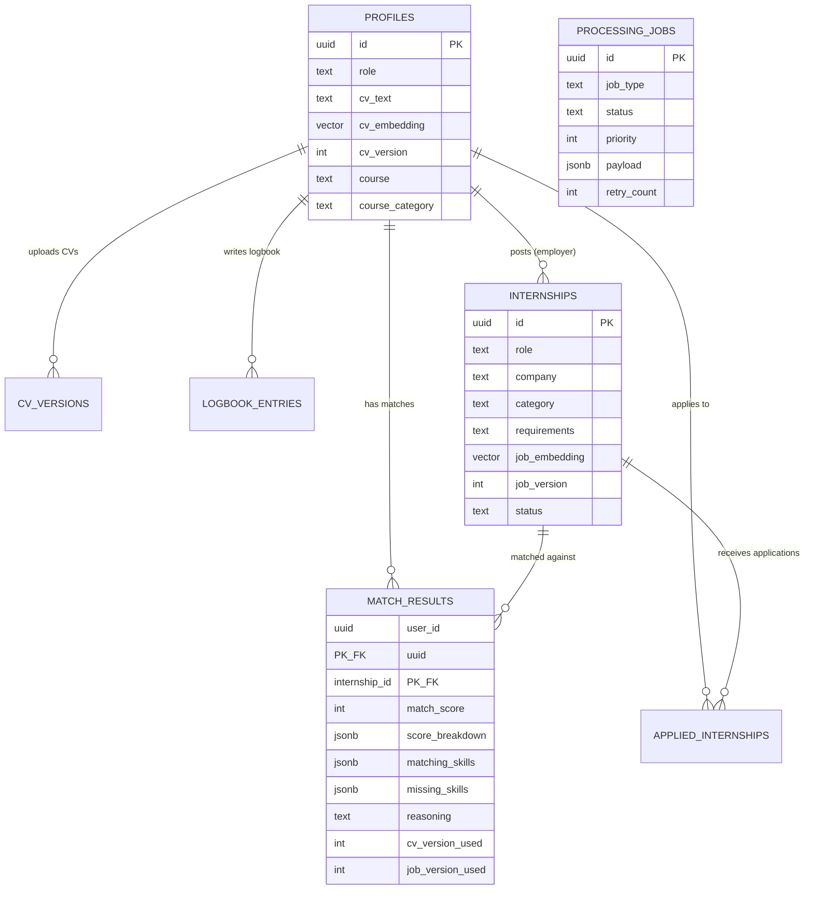
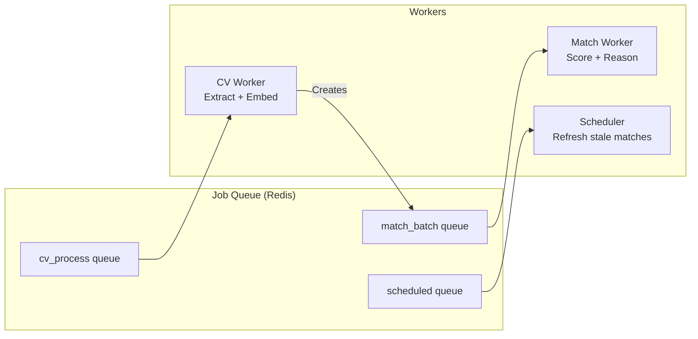

# PAU Interconnect — Internship Matching System Architecture

> Production-ready system design for the FastAPI + Supabase internship recommendation engine.
> Designed to scale from MVP (100 students) to production (100,000+ students).

---

## Table of Contents

1. [Architecture Overview](#1-architecture-overview)
2. [End-to-End User Flow](#2-end-to-end-user-flow)
3. [Matching Strategy](#3-matching-strategy)
4. [Recommendation Engine](#4-recommendation-engine)
5. [Matching Algorithm](#5-matching-algorithm)
6. [Performance & Scaling](#6-performance--scaling)
7. [Database Design](#7-database-design)
8. [API Design](#8-api-design)
9. [Background Processing](#9-background-processing)
10. [Edge Cases](#10-edge-cases)
11. [Technology Recommendations](#11-technology-recommendations)
12. [Implementation Roadmap](#12-implementation-roadmap)

---

## 1. Architecture Overview

### System Diagram



### Data Flow Sequence



---

## 2. End-to-End User Flow

### 2.1 Student Uploads a CV

| Step | Component | Action                                                   |
| ---- | --------- | -------------------------------------------------------- |
| 1    | Frontend  | Student selects PDF, hits upload                         |
| 2    | API       | Validates: file type, size ≤ 5MB, user auth              |
| 3    | API       | Uploads to Supabase Storage (`cvs/` bucket)              |
| 4    | API       | Returns `202 Accepted` with `job_id` immediately         |
| 5    | Worker    | Extracts text with pdfplumber (table fallback)           |
| 6    | Worker    | Validates: ≥ 50 chars extracted, not garbled             |
| 7    | Worker    | Cleans text: remove control chars, normalize whitespace  |
| 8    | Worker    | Generates Cohere embedding (1024-dim)                    |
| 9    | Worker    | Stores `cv_text`, `cv_embedding`, `cv_url` in `profiles` |
| 10   | Worker    | Increments `cv_version`, sets `cv_processed_at`          |
| 11   | Worker    | Enqueues MATCH_BATCH job for all active internships      |
| 12   | Worker    | Updates job status to `completed`                        |

### 2.2 Match Scores Are Generated

| Step | Component | Action                                                                  |
| ---- | --------- | ----------------------------------------------------------------------- |
| 1    | Worker    | Receives MATCH_BATCH job with internship IDs                            |
| 2    | Worker    | Pre-filters internships by category/location if profile has preferences |
| 3    | Worker    | For each internship: check cache → compute if miss                      |
| 4    | Worker    | Compute cosine similarity (CV embedding vs job embedding)               |
| 5    | Worker    | Run keyword skill analysis                                              |
| 6    | Worker    | Blend: 60% semantic + 40% keyword → `match_score`                       |
| 7    | Worker    | Generate LLM reasoning for top matches (score ≥ 40)                     |
| 8    | Worker    | Upsert into `match_results` table                                       |

### 2.3 New Internship Posted

| Step | Component | Action                                                   |
| ---- | --------- | -------------------------------------------------------- |
| 1    | Employer  | Creates internship via API                               |
| 2    | API       | Stores internship in DB                                  |
| 3    | API       | Generates and stores internship embedding                |
| 4    | API       | Enqueues INTERNSHIP_MATCH job                            |
| 5    | Worker    | Fetches all students with CVs (paginated, 100 at a time) |
| 6    | Worker    | For each student: compute match score                    |
| 7    | Worker    | Only stores results where `match_score ≥ 25`             |

### 2.4 Recommendations Appear on Dashboard

- Recommendations are **precomputed** and stored in `match_results`.
- `GET /recommendations` reads from DB, applies filters, sorts by score.
- No AI calls happen at read time — instant response.

---

## 3. Matching Strategy

### 3.1 When Matching Happens

| Trigger                                  | What Gets Matched                         | Priority   |
| ---------------------------------------- | ----------------------------------------- | ---------- |
| Student uploads/re-uploads CV            | Student → all active internships          | High       |
| New internship posted                    | New internship → all students with CVs    | Medium     |
| Internship requirements edited           | Edited internship → all students with CVs | Low        |
| Student updates profile (course, skills) | Student → all active internships          | Low        |
| Daily scheduled job                      | Stale matches (>7 days) for active users  | Background |

### 3.2 Synchronous vs Asynchronous

| Operation            | Mode               | Reason                             |
| -------------------- | ------------------ | ---------------------------------- |
| CV upload + storage  | **Sync**           | User needs immediate confirmation  |
| Text extraction      | **Async (worker)** | Blocking I/O, can take 2-10s       |
| Embedding generation | **Async (worker)** | External API call, 1-5s            |
| Match computation    | **Async (worker)** | N internships × AI calls, 10s-5min |
| LLM reasoning        | **Async (worker)** | Only for top matches, 2-5s each    |
| Get recommendations  | **Sync**           | Reads precomputed data, <100ms     |
| Skill gap analysis   | **Sync**           | Single LLM call, user is waiting   |

### 3.3 Avoiding N×M Explosion

The naive approach (every CV × every internship) creates an O(N×M) problem. At scale:

| Students | Internships | Naive Comparisons | Cost (@ $0.001/comparison) |
| -------- | ----------- | ----------------- | -------------------------- |
| 100      | 50          | 5,000             | $5                         |
| 1,000    | 200         | 200,000           | $200                       |
| 10,000   | 500         | 5,000,000         | $5,000                     |
| 100,000  | 1,000       | 100,000,000       | $100,000                   |

**Solution: Pre-filter before AI scoring.**

```
Stage 1: Category Filter (free, DB query)
  → Student studying "Computer Science" → only tech internships
  → Reduces candidates by ~70%

Stage 2: Embedding Similarity Pre-screen (cheap, cached vectors)
  → Compute cosine similarity using stored embeddings
  → Only proceed to Stage 3 if similarity ≥ 0.25
  → Reduces candidates by ~50% more

Stage 3: Full AI Scoring (expensive, keyword + semantic + LLM)
  → Only for candidates that passed Stages 1-2
  → ~15% of total pairs get full scoring

Stage 4: LLM Reasoning (most expensive)
  → Only for matches with score ≥ 40%
  → ~5% of total pairs
```

**Result at 10,000 students × 500 internships:**

- Naive: 5,000,000 AI calls
- With pre-filtering: ~75,000 full scores + ~25,000 LLM reasoning calls
- **97% cost reduction**

### 3.4 Batching and Prioritization

```python
# Priority queue for match jobs
PRIORITY_HIGH   = 1  # User just uploaded CV (they're waiting)
PRIORITY_MEDIUM = 5  # New internship posted
PRIORITY_LOW    = 10 # Scheduled re-analysis, profile update

# Batch sizes
BATCH_SIZE_CV_UPLOAD    = 50   # Process 50 internships per batch
BATCH_SIZE_NEW_INTERN   = 100  # Process 100 students per batch
BATCH_SIZE_SCHEDULED    = 200  # Larger batches for background work
```

### 3.5 Retry Logic and Failure Recovery

```python
# Retry policy for match jobs
RETRY_CONFIG = {
    "max_retries": 3,
    "retry_delays": [30, 120, 600],  # 30s, 2min, 10min
    "retry_on": [
        "EmbeddingAPIError",    # Cohere down
        "LLMProviderError",     # All LLM providers failed
        "DatabaseTimeoutError", # Supabase overloaded
    ],
    "no_retry_on": [
        "InvalidCVError",       # Unreadable PDF — won't improve on retry
        "ProfileNotFoundError", # User deleted account
    ],
}
```

Job state machine:

```
PENDING → PROCESSING → COMPLETED
                ↓
            FAILED → RETRY_1 → RETRY_2 → RETRY_3 → DEAD_LETTER
```

---

## 4. Recommendation Engine

### 4.1 Endpoint Design

```
GET /api/recommendations?page=1&page_size=20&min_score=30&category=technology
```

### 4.2 How Recommendations Are Generated

Recommendations are **precomputed** (not generated on-demand). The flow:

1. Match scores are computed by background workers and stored in `match_results`.
2. `GET /recommendations` queries `match_results` with filters and sorting.
3. Response is assembled by joining with `internships` table for display data.

**Why precomputed?**

- Instant response time (<100ms vs 10-30s for on-demand AI)
- No AI costs at read time
- Can serve thousands of concurrent users without AI bottleneck
- Stale data is acceptable (recommendations don't change every second)

### 4.3 Ranking Algorithm

```sql
-- Recommendation query (pseudocode)
SELECT
    m.internship_id,
    m.match_score,
    m.matching_skills,
    m.missing_skills,
    m.reasoning,
    i.role, i.company, i.category, i.description,
    -- Freshness bonus: newer internships rank slightly higher
    m.match_score + GREATEST(0, 5 - EXTRACT(DAY FROM now() - i.created_at)) AS ranked_score
FROM match_results m
JOIN internships i ON m.internship_id = i.id
WHERE m.user_id = :user_id
  AND m.match_score >= :min_score        -- Default: 25
  AND i.status = 'active'                -- No expired internships
  AND i.id NOT IN (                      -- Exclude already applied
      SELECT internship_id FROM applied_internships WHERE user_id = :user_id
  )
ORDER BY ranked_score DESC
LIMIT :page_size OFFSET :offset;
```

### 4.4 Score Thresholds

| Score Range | Label           | Shown to User?               |
| ----------- | --------------- | ---------------------------- |
| 80-100      | Excellent Match | Yes — highlighted            |
| 60-79       | Good Match      | Yes                          |
| 40-59       | Moderate Match  | Yes                          |
| 25-39       | Possible Match  | Yes — lower in list          |
| 0-24        | Poor Match      | Not shown in recommendations |

### 4.5 Diversity

To avoid showing 10 internships at the same company:

```sql
-- Ensure max 3 internships per company in top 20
WITH ranked AS (
    SELECT *,
        ROW_NUMBER() OVER (PARTITION BY i.company ORDER BY ranked_score DESC) as company_rank
    FROM recommendations
)
SELECT * FROM ranked WHERE company_rank <= 3
ORDER BY ranked_score DESC;
```

### 4.6 Freshness Strategy

| Scenario                       | Action                                               |
| ------------------------------ | ---------------------------------------------------- |
| Match result older than 7 days | Mark as `stale`, re-queue for background update      |
| Internship expired/closed      | Exclude from recommendations, keep in match history  |
| Student re-uploads CV          | Invalidate ALL match results, re-queue full analysis |
| Internship requirements edited | Invalidate match results for that internship only    |

---

## 5. Matching Algorithm

### 5.1 Complete Scoring Pipeline



### 5.2 Scoring Breakdown

```python
def compute_final_score(cv_text, cv_embedding, job, job_embedding, profile):
    """
    Multi-factor scoring with configurable weights.
    """

    # Factor 1: Semantic Similarity (40% weight)
    # Cosine similarity between CV and job embeddings
    # Calibrated: 0.30 cosine = 0%, 0.50 cosine = 50%, 0.70+ cosine = 100%
    cosine_sim = cosine_similarity(cv_embedding, job_embedding)
    semantic_score = clamp((cosine_sim - 0.30) * 250, 0, 100)

    # Factor 2: Keyword/Skill Match (30% weight)
    # Direct keyword overlap between CV text and job requirements
    matching, missing, keyword_ratio = analyze_skills(cv_text, job.requirements)
    keyword_score = keyword_ratio * 100

    # Factor 3: Course Relevance (15% weight)
    # Does the student's course of study align with the internship category?
    course_score = compute_course_relevance(profile.course, job.category)

    # Factor 4: Experience Level Match (10% weight)
    # Does the student's year/level match what the internship expects?
    level_score = compute_level_match(profile.level, job.experience_level)

    # Factor 5: Profile Completeness (5% weight)
    # Bonus for having a complete profile (photo, bio, skills listed)
    completeness_score = compute_profile_completeness(profile)

    # Weighted blend
    final = (
        semantic_score * 0.40 +
        keyword_score  * 0.30 +
        course_score   * 0.15 +
        level_score    * 0.10 +
        completeness_score * 0.05
    )

    return {
        "match_score": int(clamp(final, 0, 100)),
        "score_breakdown": {
            "semantic": int(semantic_score),
            "keyword": int(keyword_score),
            "course_relevance": int(course_score),
            "level_match": int(level_score),
            "profile_completeness": int(completeness_score),
        },
        "matching_skills": matching,
        "missing_skills": missing,
    }
```

### 5.3 Course Relevance Mapping

```python
COURSE_CATEGORY_MAP = {
    "computer science": ["technology", "software", "data", "ai", "cybersecurity"],
    "information technology": ["technology", "software", "networking", "support"],
    "business administration": ["business", "finance", "management", "consulting"],
    "accounting": ["finance", "accounting", "audit", "tax"],
    "mass communication": ["media", "marketing", "communications", "pr"],
    "law": ["legal", "compliance", "governance"],
    "engineering": ["technology", "engineering", "manufacturing"],
    "economics": ["finance", "economics", "research", "policy"],
    # Extend as needed
}

def compute_course_relevance(course: str, job_category: str) -> int:
    if not course or not job_category:
        return 50  # Neutral if unknown
    course_lower = course.lower()
    category_lower = job_category.lower()
    for key, categories in COURSE_CATEGORY_MAP.items():
        if key in course_lower:
            return 100 if category_lower in categories else 30
    return 50  # Unknown course — neutral
```

### 5.4 Factor Weights Rationale

| Factor               | Weight | Reasoning                                                        |
| -------------------- | ------ | ---------------------------------------------------------------- |
| Semantic similarity  | 40%    | Best signal — captures meaning beyond keywords                   |
| Keyword match        | 30%    | Directly measures stated requirements. Important for ATS systems |
| Course relevance     | 15%    | Strong signal — CS student shouldn't see law internships         |
| Experience level     | 10%    | Prevents mismatches (freshman vs senior-level roles)             |
| Profile completeness | 5%     | Rewards engaged users, breaks ties                               |

---

## 6. Performance & Scaling

### 6.1 Scaling Matrix

| Scale          | Students | Internships | Matches | Strategy                                                            |
| -------------- | -------- | ----------- | ------- | ------------------------------------------------------------------- |
| **MVP**        | 100      | 50          | 5K      | In-process `BackgroundTasks`, in-memory cache                       |
| **Growth**     | 1,000    | 200         | 200K    | Redis cache, ARQ workers (2 workers)                                |
| **Scale**      | 10,000   | 500         | 5M      | Pre-filtering reduces to ~750K, 4 workers, DB indexes               |
| **Production** | 100,000  | 1,000       | 100M    | Pre-filtering reduces to ~1.5M, 8+ workers, read replicas, pgvector |

### 6.2 Database Indexes

```sql
-- Critical indexes for query performance
CREATE INDEX idx_match_results_user_score
    ON match_results (user_id, match_score DESC);

CREATE INDEX idx_match_results_internship
    ON match_results (internship_id);

CREATE INDEX idx_match_results_updated
    ON match_results (updated_at);

CREATE INDEX idx_internships_status_category
    ON internships (status, category);

CREATE INDEX idx_internships_poster
    ON internships (poster_id);

CREATE INDEX idx_applied_internships_user
    ON applied_internships (user_id, internship_id);

CREATE INDEX idx_profiles_role_cv
    ON profiles (role) WHERE cv_text IS NOT NULL;

CREATE INDEX idx_processing_jobs_status
    ON processing_jobs (status, priority, created_at);

-- For pgvector similarity search (Scale+ tier)
CREATE INDEX idx_profiles_cv_embedding
    ON profiles USING ivfflat (cv_embedding vector_cosine_ops) WITH (lists = 100);
```

### 6.3 Caching Strategy

| Data                | Cache Layer              | TTL            | Invalidation                |
| ------------------- | ------------------------ | -------------- | --------------------------- |
| CV embeddings       | Redis + Memory           | 24h            | On CV re-upload             |
| Job embeddings      | Redis + Memory           | 24h            | On job edit                 |
| Match results       | Redis                    | 1h             | On CV re-upload or job edit |
| Recommendation list | None (DB is fast enough) | —              | —                           |
| Profile data        | Memory (per-request)     | Request-scoped | —                           |

### 6.4 Incremental Updates

Instead of recomputing everything:

```python
# When a new internship is posted:
# DON'T: Match against all 10,000 students
# DO: Match against students whose course matches the category

students = db.query("""
    SELECT id, cv_text, cv_embedding
    FROM profiles
    WHERE role = 'student'
      AND cv_text IS NOT NULL
      AND (course_category = :job_category OR course_category IS NULL)
    ORDER BY last_active_at DESC
    LIMIT 2000
""", job_category=job.category)
```

### 6.5 AI Cost Optimization

| Optimization                                                     | Savings                     |
| ---------------------------------------------------------------- | --------------------------- |
| Cache embeddings (avoid re-embedding same CV)                    | ~60% fewer Cohere calls     |
| Pre-filter before AI scoring                                     | ~85% fewer full comparisons |
| Only generate LLM reasoning for score ≥ 40                       | ~70% fewer LLM calls        |
| Batch embedding requests (Cohere supports batch)                 | ~40% lower latency          |
| Skip matching for inactive students (no login in 30 days)        | ~30% fewer comparisons      |
| Store job embeddings on internship creation (not on every match) | ~50% fewer job embeddings   |

### 6.6 Avoiding Duplicate Analysis

```python
# In the match worker, before computing:
def should_recompute(user_id, internship_id, cv_version, job_version):
    existing = db.query("""
        SELECT cv_version_used, job_version_used, updated_at
        FROM match_results
        WHERE user_id = :uid AND internship_id = :iid
    """)
    if not existing:
        return True  # Never computed
    if existing.cv_version_used < cv_version:
        return True  # CV was updated
    if existing.job_version_used < job_version:
        return True  # Job requirements changed
    if (now - existing.updated_at).days > 7:
        return True  # Stale
    return False  # Still valid, skip
```

---

## 7. Database Design

### 7.1 Current Tables (Keep)

#### `profiles`

```sql
CREATE TABLE profiles (
    id UUID PRIMARY KEY REFERENCES auth.users(id),
    full_name TEXT,
    email TEXT,
    role TEXT CHECK (role IN ('student', 'employer', 'admin')),
    -- Student fields
    course TEXT,
    level TEXT,
    cv_text TEXT,
    cv_url TEXT,
    cv_embedding VECTOR(1024),           -- NEW: stored embedding
    cv_version INTEGER DEFAULT 0,         -- NEW: increments on re-upload
    cv_processed_at TIMESTAMPTZ,          -- NEW: when AI last processed CV
    course_category TEXT,                 -- NEW: normalized category for filtering
    -- Employer fields
    company_name TEXT,
    company_description TEXT,
    company_website TEXT,
    company_logo_url TEXT,
    company_banner_url TEXT,
    industry TEXT,
    culture TEXT,
    -- Admin
    is_admin BOOLEAN DEFAULT FALSE,
    -- Timestamps
    last_active_at TIMESTAMPTZ,           -- NEW: for prioritizing active users
    created_at TIMESTAMPTZ DEFAULT NOW(),
    updated_at TIMESTAMPTZ DEFAULT NOW()
);
```

#### `internships`

```sql
CREATE TABLE internships (
    id UUID PRIMARY KEY DEFAULT gen_random_uuid(),
    role TEXT NOT NULL,
    company TEXT NOT NULL,
    category TEXT,
    description TEXT,
    requirements TEXT,                    -- Can be text or JSON array
    poster_id UUID REFERENCES profiles(id),
    employer_email TEXT,
    status TEXT DEFAULT 'active' CHECK (status IN ('active', 'closed', 'expired')),  -- NEW
    job_embedding VECTOR(1024),           -- NEW: stored embedding
    job_version INTEGER DEFAULT 1,        -- NEW: increments on edit
    location TEXT,                        -- NEW: for location filtering
    experience_level TEXT,                -- NEW: 'any', 'beginner', 'intermediate'
    created_at TIMESTAMPTZ DEFAULT NOW(),
    updated_at TIMESTAMPTZ DEFAULT NOW()
);
```

#### `match_results`

```sql
CREATE TABLE match_results (
    user_id UUID REFERENCES profiles(id) ON DELETE CASCADE,
    internship_id UUID REFERENCES internships(id) ON DELETE CASCADE,
    match_score INTEGER CHECK (match_score BETWEEN 0 AND 100),
    matching_skills JSONB DEFAULT '[]',
    missing_skills JSONB DEFAULT '[]',
    reasoning TEXT,
    score_breakdown JSONB,               -- NEW: {"semantic": 65, "keyword": 80, ...}
    cv_version_used INTEGER,             -- NEW: which CV version produced this score
    job_version_used INTEGER,            -- NEW: which job version produced this score
    is_stale BOOLEAN DEFAULT FALSE,      -- NEW: flag for background refresh
    created_at TIMESTAMPTZ DEFAULT NOW(),
    updated_at TIMESTAMPTZ DEFAULT NOW(),
    PRIMARY KEY (user_id, internship_id)
);
```

#### `applied_internships`

```sql
CREATE TABLE applied_internships (
    id UUID PRIMARY KEY DEFAULT gen_random_uuid(),
    user_id UUID REFERENCES profiles(id) ON DELETE CASCADE,
    internship_id UUID REFERENCES internships(id) ON DELETE CASCADE,
    cover_letter TEXT,
    status TEXT DEFAULT 'pending' CHECK (status IN ('pending', 'reviewed', 'shortlisted', 'accepted', 'rejected')),
    match_score INTEGER,
    created_at TIMESTAMPTZ DEFAULT NOW(),
    UNIQUE (user_id, internship_id)
);
```

### 7.2 New Tables

#### `processing_jobs` — Track background work

```sql
CREATE TABLE processing_jobs (
    id UUID PRIMARY KEY DEFAULT gen_random_uuid(),
    job_type TEXT NOT NULL CHECK (job_type IN (
        'cv_process', 'match_batch', 'internship_match', 'scheduled_refresh'
    )),
    status TEXT DEFAULT 'pending' CHECK (status IN (
        'pending', 'processing', 'completed', 'failed', 'dead_letter'
    )),
    priority INTEGER DEFAULT 5,          -- 1 = highest, 10 = lowest
    payload JSONB NOT NULL,              -- {user_id, internship_ids, batch_number, etc.}
    result JSONB,                        -- {matches_created, errors, duration_ms}
    error_message TEXT,
    retry_count INTEGER DEFAULT 0,
    max_retries INTEGER DEFAULT 3,
    started_at TIMESTAMPTZ,
    completed_at TIMESTAMPTZ,
    created_at TIMESTAMPTZ DEFAULT NOW()
);
```

#### `cv_versions` — Track CV upload history

```sql
CREATE TABLE cv_versions (
    id UUID PRIMARY KEY DEFAULT gen_random_uuid(),
    user_id UUID REFERENCES profiles(id) ON DELETE CASCADE,
    version INTEGER NOT NULL,
    cv_url TEXT,
    cv_text TEXT,
    text_length INTEGER,
    ats_score INTEGER,
    processed_at TIMESTAMPTZ,
    created_at TIMESTAMPTZ DEFAULT NOW()
);
```

#### `ai_usage_log` — Track AI API costs

```sql
CREATE TABLE ai_usage_log (
    id UUID PRIMARY KEY DEFAULT gen_random_uuid(),
    provider TEXT NOT NULL,              -- 'cohere', 'groq', 'together', etc.
    operation TEXT NOT NULL,             -- 'embedding', 'completion', 'reasoning'
    tokens_used INTEGER,
    latency_ms INTEGER,
    success BOOLEAN DEFAULT TRUE,
    error_message TEXT,
    created_at TIMESTAMPTZ DEFAULT NOW()
);
```

### 7.3 Database Entity Relationship



---

## 8. API Design

### 8.1 CV Operations

#### Upload and Analyze CV

```
POST /api/cv/upload-and-analyze
Content-Type: multipart/form-data
Authorization: Bearer <jwt>

Body: { user_id: string, file: PDF }

Response 202:
{
    "message": "CV uploaded. Analysis started.",
    "job_id": "uuid",
    "cv_url": "https://...",
    "text_length": 2340
}

Response 400:
{ "error": "Only PDFs are supported." }
{ "error": "File too large. Maximum size is 5MB." }
{ "error": "Could not extract enough text from your PDF." }
```

#### Re-analyze Existing CV

```
POST /api/cv/analyze-existing
Authorization: Bearer <jwt>

Body: { "user_id": "uuid" }

Response 202:
{
    "message": "Re-analysis started.",
    "job_id": "uuid"
}
```

#### Get Processing Status

```
GET /api/cv/processing-status?job_id=uuid
Authorization: Bearer <jwt>

Response 200:
{
    "job_id": "uuid",
    "status": "processing",        // pending | processing | completed | failed
    "progress": {
        "total_internships": 45,
        "matched_so_far": 23
    },
    "started_at": "2026-07-10T10:00:00Z"
}
```

#### Refresh CV URL

```
POST /api/cv/refresh-url
Authorization: Bearer <jwt>

Body: { "user_id": "uuid" }

Response 200:
{ "cv_url": "https://new-signed-url..." }
```

### 8.2 Recommendations

#### Get Recommendations

```
GET /api/recommendations?page=1&page_size=20&min_score=30&category=technology
Authorization: Bearer <jwt>

Response 200:
{
    "recommendations": [
        {
            "internship_id": "uuid",
            "role": "Frontend Developer Intern",
            "company": "TechCorp",
            "category": "technology",
            "match_score": 78,
            "score_breakdown": {
                "semantic": 82,
                "keyword": 70,
                "course_relevance": 100,
                "level_match": 80,
                "profile_completeness": 60
            },
            "matching_skills": ["React", "JavaScript", "CSS"],
            "missing_skills": ["TypeScript", "GraphQL"],
            "reasoning": "Strong frontend skills with React experience align well...",
            "posted_at": "2026-07-08T10:00:00Z"
        }
    ],
    "pagination": {
        "page": 1,
        "page_size": 20,
        "total": 34,
        "total_pages": 2
    },
    "meta": {
        "last_analyzed_at": "2026-07-10T09:30:00Z",
        "cv_version": 2,
        "stale_count": 3
    }
}
```

#### Get Match History (all matches, including applied)

```
GET /api/match-history?page=1&page_size=50
Authorization: Bearer <jwt>

Response 200:
{
    "matches": [
        {
            "internship_id": "uuid",
            "role": "Data Analyst Intern",
            "company": "DataCo",
            "match_score": 85,
            "status": "applied",           // "available" | "applied" | "expired"
            "matched_at": "2026-07-09T14:00:00Z"
        }
    ],
    "pagination": { ... }
}
```

### 8.3 Analysis

#### Skill Gap Analysis

```
GET /api/analysis/skill-gap?internship_id=uuid
Authorization: Bearer <jwt>

Response 200:
{
    "match_percentage": 65,
    "current_skills": ["Python", "SQL", "Data Analysis"],
    "missing_skills": [
        {
            "skill": "Machine Learning",
            "priority": "High",
            "estimated_learning_time": "4 weeks"
        }
    ],
    "recommendations": [
        "Complete Andrew Ng's Machine Learning course on Coursera",
        "Build a portfolio project using scikit-learn"
    ],
    "strengths_summary": "Strong data fundamentals with Python and SQL proficiency."
}
```

#### Dashboard Metrics

```
GET /api/analysis/metrics
Authorization: Bearer <jwt>

Response 200:
{
    "career_score": 72,
    "ats_score": 68,
    "weekly_progress": 60,
    "total_xp": 850,
    "streak_days": 3,
    "applications_sent": 5,
    "avg_match_rate": 64,
    "top_match_score": 92,
    "recommendations_count": 34
}
```

### 8.4 Internship Matching (Admin/Employer)

#### Trigger Matching for New Internship

```
POST /api/cv/analyze-new-internship
Authorization: Bearer <jwt>

Body: { "internship_id": "uuid" }

Response 202:
{
    "message": "AI matching started for 156 students.",
    "job_id": "uuid"
}
```

### 8.5 Admin Endpoints

#### Get Processing Queue Status

```
GET /api/admin/processing-queue?status=pending
Authorization: Bearer <jwt> (admin)

Response 200:
{
    "jobs": [
        {
            "id": "uuid",
            "job_type": "match_batch",
            "status": "processing",
            "priority": 1,
            "created_at": "2026-07-10T10:00:00Z",
            "retry_count": 0
        }
    ],
    "summary": {
        "pending": 12,
        "processing": 3,
        "failed": 1,
        "completed_today": 45
    }
}
```

#### Retry Failed Jobs

```
POST /api/admin/retry-failed-jobs
Authorization: Bearer <jwt> (admin)

Response 200:
{ "retried": 3 }
```

---

## 9. Background Processing

### 9.1 Worker Architecture



### 9.2 Job Types

#### `cv_process` — New CV Upload

```python
async def process_cv(job):
    user_id = job.payload["user_id"]
    file_path = job.payload["file_path"]

    # 1. Extract text
    cv_text = await asyncio.to_thread(extract_text, file_path)
    cv_text = clean_cv_text(cv_text)

    if len(cv_text.strip()) < 50:
        raise InvalidCVError("Insufficient text extracted")

    # 2. Generate embedding
    cv_embedding = await get_embedding(cv_text[:6000])

    # 3. Compute ATS score
    ats_score = compute_ats_score(cv_text)

    # 4. Store results
    new_version = await increment_cv_version(user_id)
    await save_cv_data(user_id, cv_text, cv_embedding, ats_score, new_version)

    # 5. Enqueue match jobs
    internship_ids = await get_active_internship_ids(category=profile.course_category)
    for batch in chunked(internship_ids, BATCH_SIZE_CV_UPLOAD):
        await enqueue("match_batch", {
            "user_id": user_id,
            "internship_ids": batch,
            "cv_version": new_version,
        }, priority=PRIORITY_HIGH)
```

#### `match_batch` — Score a Batch of Internships

```python
async def process_match_batch(job):
    user_id = job.payload["user_id"]
    internship_ids = job.payload["internship_ids"]

    profile = await get_profile_with_embedding(user_id)
    semaphore = asyncio.Semaphore(5)  # Max 5 concurrent AI calls

    async def score_one(internship_id):
        async with semaphore:
            job_data = await get_internship_with_embedding(internship_id)
            if not job_data or job_data.get("status") != "active":
                return None

            # Check if recomputation needed
            if not should_recompute(user_id, internship_id,
                                     profile["cv_version"], job_data["job_version"]):
                return None  # Skip, existing result is current

            result = await compute_match_score(
                profile["cv_text"], profile["cv_embedding"],
                job_data, job_data["job_embedding"],
                profile
            )
            await upsert_match_result(user_id, internship_id, result,
                                       profile["cv_version"], job_data["job_version"])
            return result

    results = await asyncio.gather(
        *[score_one(iid) for iid in internship_ids],
        return_exceptions=True
    )

    success = sum(1 for r in results if r and not isinstance(r, Exception))
    errors = sum(1 for r in results if isinstance(r, Exception))

    return {"matched": success, "errors": errors}
```

#### `internship_match` — New Internship Posted

```python
async def process_new_internship(job):
    internship_id = job.payload["internship_id"]
    internship = await get_internship(internship_id)

    # Generate and store internship embedding
    job_text = f"{internship['role']} {internship['description']} {internship['requirements']}"
    job_embedding = await get_embedding(job_text)
    await store_job_embedding(internship_id, job_embedding)

    # Get eligible students (pre-filtered by category)
    students = await get_students_with_cvs(category=internship.get("category"))

    for batch in chunked(students, BATCH_SIZE_NEW_INTERN):
        await enqueue("match_batch", {
            "internship_ids": [internship_id],
            "student_batch": [s["id"] for s in batch],
        }, priority=PRIORITY_MEDIUM)
```

#### `scheduled_refresh` — Keep Recommendations Fresh

```python
# Runs daily via cron/scheduler
async def refresh_stale_matches():
    stale = await db.query("""
        SELECT DISTINCT user_id FROM match_results
        WHERE is_stale = TRUE OR updated_at < NOW() - INTERVAL '7 days'
        ORDER BY updated_at ASC
        LIMIT 500
    """)

    for batch in chunked(stale, 50):
        await enqueue("match_batch", {
            "user_ids": [s["user_id"] for s in batch],
            "reason": "scheduled_refresh",
        }, priority=PRIORITY_LOW)
```

### 9.3 Worker Events Summary

| Event                          | Worker Action                                                          |
| ------------------------------ | ---------------------------------------------------------------------- |
| Student uploads CV             | Extract → Embed → Store → Enqueue match jobs                           |
| Student re-uploads CV          | Increment version → Extract → Embed → Invalidate old matches → Enqueue |
| New internship posted          | Embed job → Enqueue match for eligible students                        |
| Internship requirements edited | Increment job_version → Re-embed → Mark matches as stale               |
| Internship deleted/closed      | Mark status='closed' → Remove from recommendations (soft)              |
| Student updates profile        | If course changed: re-categorize → flag matches stale                  |
| Scheduled daily refresh        | Find stale matches → Re-queue lowest priority                          |
| Failed AI request              | Retry with backoff → After 3 fails: dead letter                        |

---

## 10. Edge Cases

### 10.1 Input Edge Cases

| Scenario                     | Handling                                                                                              |
| ---------------------------- | ----------------------------------------------------------------------------------------------------- |
| **Duplicate CV upload**      | Increment `cv_version`, overwrite `cv_text`, invalidate all match results                             |
| **Corrupted/empty PDF**      | Return 400 with message "Could not extract text". Do not store. Do not match.                         |
| **Image-only PDF (scanned)** | Detected by `len(cv_text) < 50`. Return 400 suggesting text-based PDF. Future: add OCR via Tesseract. |
| **Very large PDF (>5MB)**    | Reject at API level before storage. Return 400.                                                       |
| **PDF with tables only**     | pdfplumber table extraction fallback extracts tabular data                                            |
| **Non-English CV**           | Cohere embed-english-v3.0 handles some multilingual. Flag for user if <100 English words detected.    |

### 10.2 AI Edge Cases

| Scenario                            | Handling                                                                                                                                |
| ----------------------------------- | --------------------------------------------------------------------------------------------------------------------------------------- |
| **All LLM providers fail**          | Match score still computed (embedding + keyword). Reasoning = fallback text. Job retries 3x.                                            |
| **Embedding API fails**             | Retry 3x with exponential backoff. If all fail: keyword-only scoring (40% weight → 100%).                                               |
| **LLM returns invalid JSON**        | `parse_json_from_llm()` extracts JSON from markdown blocks. If still invalid: return 500 on skill-gap, use fallback reasoning on match. |
| **LLM returns hallucinated skills** | Skill gap analysis cross-references against CV text. Prompt explicitly says "only skills ACTUALLY in the resume".                       |
| **Embedding dimension mismatch**    | Logged as warning, cosine similarity returns 0.0, keyword-only fallback kicks in.                                                       |
| **API rate limit (429)**            | Retry with exponential backoff. Semaphore limits concurrent calls to 5.                                                                 |

### 10.3 Data Edge Cases

| Scenario                                    | Handling                                                                                                      |
| ------------------------------------------- | ------------------------------------------------------------------------------------------------------------- |
| **Internship deleted while matching**       | Worker checks `status = 'active'` before scoring. Skips if deleted.                                           |
| **Student deletes account during matching** | `ON DELETE CASCADE` removes their match_results. Worker catches `ProfileNotFoundError`.                       |
| **Stale recommendations**                   | `is_stale` flag + `updated_at` check. Scheduled refresh job runs daily.                                       |
| **Duplicate recommendations**               | Prevented by `PRIMARY KEY (user_id, internship_id)` on match_results. UPSERT handles conflicts.               |
| **No internships in DB**                    | Recommendations endpoint returns empty array with message. No background jobs enqueued.                       |
| **Student has no course/level set**         | Course relevance defaults to 50 (neutral). Level match defaults to 50. Still gets recommendations.            |
| **Internship has no requirements**          | Keyword score defaults to 0. Semantic score still works from description. Overall score weighted accordingly. |

### 10.4 Concurrency Edge Cases

| Scenario                                       | Handling                                                                                                                   |
| ---------------------------------------------- | -------------------------------------------------------------------------------------------------------------------------- |
| **Two uploads for same user simultaneously**   | `cv_version` monotonically increases. Latest version wins. `UPSERT` on match_results prevents duplicates.                  |
| **Matching job runs after internship deleted** | Worker checks internship exists and is active before scoring.                                                              |
| **Race between match and application**         | Application reads `match_score` from `match_results`. If not yet computed, defaults to 0. Updated when matching completes. |

---

## 11. Technology Recommendations

### 11.1 Recommended Stack

| Component           | MVP (Now)                   | Scale (1K+ users)           | Production (100K+)            |
| ------------------- | --------------------------- | --------------------------- | ----------------------------- |
| **API**             | FastAPI                     | FastAPI                     | FastAPI + load balancer       |
| **Database**        | Supabase PostgreSQL         | Supabase Pro                | Supabase Pro + read replicas  |
| **Background Jobs** | FastAPI `BackgroundTasks`   | **ARQ** (async Redis queue) | ARQ or **Dramatiq** + Redis   |
| **Cache**           | In-memory `TwoLayerCache`   | Redis                       | Redis Cluster                 |
| **Embeddings**      | Cohere `embed-english-v3.0` | Same                        | Same (batch mode)             |
| **LLM**             | Groq `llama-3.3-70b`        | Same                        | Same + response caching       |
| **Vector Search**   | Cosine sim in Python        | Supabase `pgvector`         | pgvector + IVFFlat index      |
| **File Storage**    | Supabase Storage            | Same                        | Same + CDN                    |
| **Monitoring**      | `logging`                   | Sentry + structured logs    | Sentry + Prometheus + Grafana |
| **Scheduling**      | Manual/cron                 | APScheduler                 | APScheduler or Celery Beat    |

### 11.2 Why ARQ Over Celery

| Factor                | Celery                         | ARQ                    | Winner |
| --------------------- | ------------------------------ | ---------------------- | ------ |
| Async native          | No (sync by default)           | Yes (built on asyncio) | ARQ    |
| Setup complexity      | High (broker, backend, worker) | Low (just Redis)       | ARQ    |
| FastAPI compatibility | Requires sync↔async bridging   | Native async           | ARQ    |
| Maturity              | Very mature                    | Newer but stable       | Celery |
| Feature richness      | Very rich                      | Sufficient             | Celery |
| Memory footprint      | Higher                         | Lower                  | ARQ    |

**Recommendation:** ARQ for this project. It's async-native like FastAPI, uses Redis (already in the stack), and handles the job queue pattern without Celery's overhead.

### 11.3 Why Keep Cohere + Groq

| Alternative                     | Pros                              | Cons                            | Verdict                     |
| ------------------------------- | --------------------------------- | ------------------------------- | --------------------------- |
| OpenAI `text-embedding-3-small` | Higher quality                    | $0.02/1M tokens, vendor lock-in | Keep Cohere (free tier)     |
| OpenAI `gpt-4o-mini`            | Best JSON output                  | $0.15/1M input, not free        | Consider for skill-gap only |
| Google Gemini Flash             | Free tier, great JSON             | Less embedding quality          | Consider as LLM fallback    |
| Groq Llama 3.3 70B              | Free, fast, good JSON mode        | Rate limits on free tier        | **Keep as primary**         |
| Cohere embed-english-v3.0       | 1024-dim, high quality, free tier | English-focused                 | **Keep as primary**         |

---

## 12. Implementation Roadmap

### Phase 1: MVP Fixes (Current Sprint — 1-2 days)

These are changes to the existing codebase, no new infrastructure:

- [x] Fix LLM `max_tokens` (600 → 2048)
- [x] Fix fallback models (8B → 70B)
- [x] Add `json_mode=True` for structured outputs
- [x] Fix scoring formula calibration
- [x] Add LLM-generated reasoning
- [x] Add file size validation (5MB limit)
- [x] Add text extraction validation (min 50 chars)
- [x] Secure debug endpoint
- [x] Add ATS score computation
- [x] Improve keyword matching (expanded aliases, compound skills)
- [ ] Add `GET /api/recommendations` endpoint
- [ ] Add internship status field (`active`/`closed`)
- [ ] Store job embeddings on internship creation
- [ ] Add `cv_version` tracking to profiles

### Phase 2: Background Queue (Week 2)

Replace `BackgroundTasks` with proper job queue:

- [ ] Add ARQ dependency and Redis connection
- [ ] Create worker functions for `cv_process`, `match_batch`
- [ ] Add `processing_jobs` table
- [ ] Add `GET /api/cv/processing-status` endpoint
- [ ] Add retry logic with dead-letter handling
- [ ] Return `202 Accepted` with job ID from upload endpoint

### Phase 3: Pre-filtering & Optimization (Week 3)

Reduce AI costs by ~85%:

- [ ] Add `course_category` to profiles
- [ ] Add category-based pre-filtering before matching
- [ ] Store embeddings in DB (`cv_embedding`, `job_embedding` columns)
- [ ] Enable pgvector for similarity pre-screening
- [ ] Add `cv_version_used` / `job_version_used` to skip unnecessary recomputation
- [ ] Batch Cohere embedding requests

### Phase 4: Multi-factor Scoring (Week 4)

Upgrade from 2-factor to 5-factor scoring:

- [ ] Add course relevance scoring
- [ ] Add experience level matching
- [ ] Add profile completeness scoring
- [ ] Store `score_breakdown` in match_results
- [ ] Update recommendation endpoint to show breakdown

### Phase 5: Production Hardening (Week 5+)

- [ ] Add Sentry error tracking
- [ ] Add structured logging with request IDs
- [ ] Add scheduled stale-match refresh (daily cron)
- [ ] Add AI usage logging (`ai_usage_log` table)
- [ ] Add rate limiting on upload endpoints
- [ ] Add health check for AI provider status
- [ ] Load testing with 1,000 simulated users
- [ ] Add database indexes (see Section 6.2)

---

## Design Decision Log

| Decision                                 | Chosen                                  | Alternative        | Rationale                                                                  |
| ---------------------------------------- | --------------------------------------- | ------------------ | -------------------------------------------------------------------------- |
| Precomputed vs on-demand recommendations | Precomputed                             | On-demand          | Instant reads, no AI at query time, scales to 100K users                   |
| Embedding provider                       | Cohere                                  | OpenAI             | Free tier, 1024-dim quality, English sufficient for this use case          |
| LLM provider                             | Groq (Llama 3.3 70B)                    | OpenAI GPT-4o-mini | Free, JSON mode support, fast inference                                    |
| Background queue                         | ARQ                                     | Celery             | Async-native, less overhead, matches FastAPI's async model                 |
| Vector storage                           | pgvector in Supabase                    | Pinecone/Weaviate  | No additional service, native PostgreSQL, good enough for <1M vectors      |
| Scoring model                            | Hybrid (semantic + keyword + heuristic) | Pure LLM scoring   | 97% cheaper, more deterministic, LLM only for reasoning                    |
| Cache layer                              | Redis + in-memory                       | Redis only         | In-memory avoids network hop for hot data, Redis provides persistence      |
| CV text storage                          | In profiles table                       | Separate table     | Simpler queries, acceptable for MVP. Move to separate table at 100K+ users |
